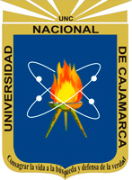
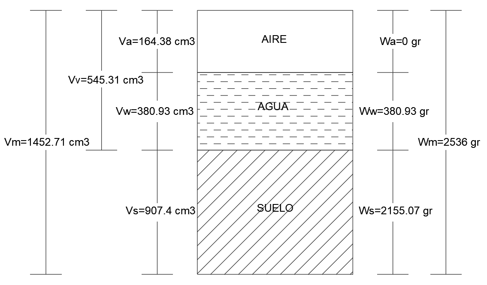
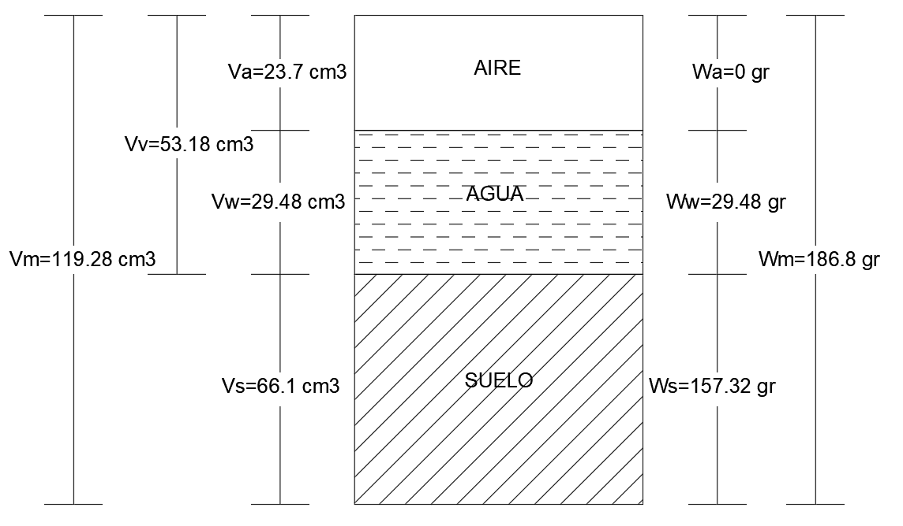

<b>RELACIONES GRANULOMÉTRICAS Y VOLUMÉTRICAS</b>

<b>Hecho por: Hebert Alex Torres Paisig</b>

<b>Curso: Mecanica de Suelos I</b>

<b>Universidad Nacional de Cajamarca</b>

<b>Fecha: 24/11/2023</b>

## I.	INTRODUCCION

Las relaciones granulométricas y volumétricas son parámetros esenciales en el estudio de los suelos finos permitiendo conocer las propiedades de un suelo siendo herramientas clave para comprender la composición y comportamiento físico de los suelos finos. Para ello, es importante poder determinar las relaciones volumétricas, gravimétricas de los suelos, relaciones de peso y volumen, relaciones fundamentales, porosidad y la relación de vacíos.
## II.	OBJETIVOS

### 2.1.	OBJETIVOS GENERALES 
* Establecer las relaciones gravimétricas y volumétricas
### 2.2.	OBJETIVOS ESPECIFICOS
* Determinar la densidad natural, pesos específicos y contenido de humedad de las muestras usadas.
* Calcular la relación de vacíos, grado de saturación y porosidad. 
* Conocer los procedimientos antes de la práctica las relaciones gravimétricas y volumétricas.

## III.	MARCO TEORICO

### 3.1. ANTECEDENTES

**Antecedentes Internacional**

Ruda et al. (2016) en su investigación “RELACIONES GRAVIMETRICAS Y VOLUMETRICAS” realizado en Pamplona – Colombia, Concluye solamente que su relación de vacío de 59% y una gravedad especifica de 2.8. Además, con el porcentaje de humedad, nos podemos hacer una idea de que tan absorbente puede ser un suelo, y además de que tanto espacio vacío tiene.

**Antecedentes Nacional**

Morales. J (2019) en su Tesis “INFLUENCIA DEL GRADO DE SATURACIÓN EN LA CAPACIDAD DE CARGA ÚLTIMA DE UNA ARCILLA DE ALTA PLASTICIDAD CON FINES DE CIMENTACIÓN PARA VIVIENDAS FAMILIARES EN LA ZONA DEL DESVIÓ CHEJOÑA DE LA CIUDAD DE PUNO” realizado en Juliaca – Perú, Concluye solamente La disminución de la capacidad de carga última (qu) de una arcilla de alta plasticidad (CH) se dio con la influencia del grado de saturación (%s), mediante los resultados del ensayo de compresión no confinada con una reducción promedio del 72.19%. Además, al someter a muestras remoldeadas al ensayo de compresión simple con diferentes grados de saturacion (60%, 70%, 80%, 90%, 100%), se determinará que la cohesión no drenada, presenta una disminución del 54.92% con respecto al aumento del grado de saturación.

**Antecedentes Locales**

Collantes. D (2020) en su investigación “RELACIONES GRAVIMÉTRICAS Y VOLUMÉTRICAS DEL SUELO” realizado en Cajamarca – Perú, Concluye solamente que, habiendo calculado las relaciones gravimétricas, según el grado de saturación de ambos problemas se trata de un suelo húmedo. También, Habiendo calculado la porosidad y saliendo más del 50% en ambos problemas se concluye que son arcillas.

## IV.	METODOLOGIA

### 4.1. ENSAYO DE CONTENIDO DE HUMEDAD (W%)
**TABLA N°1**. _Ensayo de contenido de humedad (w%)_

| ENSAYO DE CONTENIDO DE HUMEDAD (W%) |
|----------------------|
| Norma ASTM D 2216 |
|Norma ASSHTO T - 265 - 2015 |
| Norma NTP 339.127 -199 |
| Norma MTC E 108 - 2000 |

### 4.2. ENSAYO DE DENSIDAD NATURAL (g/cm³)
**TABLA N°2**. _Ensayo de densidad natural (g/cm³)_

| ENSAYO DE DENSIDAD NATURAL (g/cm³) |
|----------------------|
| Norma ASTM D 1556 - 82 |
|Norma ASSHTO T - 191 |
| Norma NTP 339.143 - 1999|
| Norma MTC E 177 - 2000 |

### 4.3.	ENSAYO DE PESO ESPECÍFICO DE SÓLIDOS (gr)
**TABLA N°3**. _Ensayo de peso específico de sólidos (gr)_

| ENSAYO DE PESO ESPECÍFICO DE SÓLIDOS (gr) |
|----------------------|
| Norma ASTM D 854:00 |
|Norma ASSHTO T - 100|
| Norma NTP 339.131 -1999|
| Norma MTC E 205 |

## V.	RESULTADOS
**Muestra N°1, en Muestra del Hoyo**

**Tabla N°4**._Pesos y volúmenes de una muestra parcialmente saturada, en la muestra de hoyo_

| Descripción | Valor |
|------------------------|------------------------|
| Peso de la fase sólida |2155.07 |
| Peso de la fase líquida |  380.93|
| Peso de la fase gaseosa | 0 |
| Peso total de la muestra húmeda | 2536 |
| Volumen de la fase solida | 907.4 |
| Volumen de la fase líquida | 380.93 |
| Volumen de la fase gaseosa| 164.38 |
| Volumen total de la muestra húmeda | 1452.71 |
| Volumen de vacíos | 545.31 |
| Relación de vacíos| 60.1 |
| Grado de saturación | 69.855 |
| Porosidad n| 37.54 |

Interpretación gráfica, representando pesos y volúmenes mediante el programa “AutoCAD”:

  

    
    Hebert Torres | Update: 24/11/23 | AUTOCAD

**FIGURA N°1**.Pesos y volúmenes de una muestra parcialmente saturada. en la muestra de hoyo

**Muestra N°2, en Muestra del Cilindro**

**Tabla N°5**._Pesos y volúmenes de una muestra parcialmente saturada de la muestra del cilindro_

| Descripción | Valor |
|------------------------|------------------------|
| Peso de la fase sólida |156.8 |
| Peso de la fase líquida |30|
| Peso de la fase gaseosa |0 |
| Peso total de la muestra húmeda |186.8 |
| Volumen de la fase solida |65.88 |
| Volumen de la fase líquida |30 |
| Volumen de la fase gaseosa| 23.4 |
| Volumen total de la muestra húmeda |119.28 |
| Volumen de vacíos | 53.4 |
| Relación de vacíos| 81.06 |
| Grado de saturación | 56.18 |
| Porosidad n| 44.77 |

Interpretación gráfica, representando pesos y volúmenes mediante el programa “AutoCAD”:

  

    
    Hebert Torres | Update: 24/11/23 | AUTOCAD

**FIGURA N°2**. _Pesos y volúmenes de una muestra parcialmente saturada de la muestra del cilindro_

## VI.	CONCLUSIONES

* Se obtuvo al hallar los grados de saturación de que en ambas muestras no llegan a sobrepasar el 100% por lo tanto dichos suelos vienen hacer parcialmente saturados. En la muestra del Cilindro, 55.43%; y en la muestra del Hoy, 69.855%.

*	Se obtuvo al hallar la relación de vacíos de que en ambas muestras no llegan a sobrepasar el 100% por lo tanto dichos suelo es compacto y las partículas sólidas que lo constituyen tienen un alto grado de acomodo. En la muestra del Cilindro, 80.45%; y en la muestra del Hoyo, 60.1%.

*	Al hacer todos los pasos explicados por la Ingeniera, se obtuvo de forma eficaz la densidad natural, pesos específicos y contenido de humedad de las muestras.

* En la muestra del cilindro presenta, 44.58% de porosidad; así como la muestra del hoyo, de 37.54%, por lo que la zona donde realizamos nuestra calicata existirá poco contenida de agua y clara veracidad sería el valor del contenido de humedad determinado.

## VII.	CONCLUSIONES

* Crespo, C (2004). “Mecánica de Suelos y Cimentaciones (5a. Ed.)”. México: Limus

* Duque, G y Escobar, C (2002). “Mecánica de los Suelos”. Universidad Nacional de Colombia (Sede Manizales). Colombia.

* Morales. J (2019) “INFLUENCIA DEL GRADO DE SATURACIÓN EN LA CAPACIDAD DE CARGA ÚLTIMA DE UNA ARCILLA DE ALTA PLASTICIDAD CON FINES DE CIMENTACIÓN PARA VIVIENDAS FAMILIARES EN LA ZONA DEL DESVIÓ CHEJOÑA DE LA CIUDAD DE PUNO”. Universidad Andina “Néstor Cáceres Velásquez”. Juliaca – Perú. 

* Rico, A Del Castillo, H (1983). “La Ingeniería de Suelos”. México: Limusa.

* Ruda et al. (2016) “RELACIONES GRAVIMETRICAS Y VOLUMETRICAS”. Universidad Nacional de Pamplona – Colombia.

* Collantes. D (2020) “RELACIONES GRAVIMÉTRICAS Y VOLUMÉTRICAS DEL SUELO”. Universidad Nacional de Cajamarca. Cajamarca – Perú.

## VIII. AGRADECIMIENTO

 ING. Luis Maldonado

 Dra. Rosa Llique Mondragon